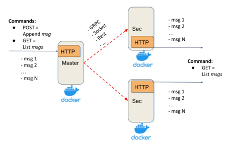

# Iteration 1.
10 points

The Replicated Log should have the following deployment architecture: one Master and any number of Secondaries.


**_Master_** should expose a simple HTTP server (or alternative service with a similar API) with: 
- _POST method_ - appends a message to the in-memory list
- _GET method_ - returns all messages from the in-memory list

**_Secondary_** should expose a simple  HTTP server(or alternative service with a similar API)  with:
- _GET method_ - returns all replicated messages from the in-memory list


Properties and assumptions:
- after each POST request, the message should be replicated on every Secondary server
- Master should ensure that Secondaries have received a message via ACK
- Master’s POST request should be finished only after receiving ACKs from all Secondaries (blocking replication approach)
- to test that the replication is blocking, introduce a delay/sleep on the Secondary
- at this stage, assume that the communication channel is a perfect link (no failures and messages lost)
- any RPC framework can be used for Master-Secondary communication (Sockets, language-specific RPC, HTTP, Rest, gRPC, …)
- your implementation should support logging 
- Master and Secondaries should run in Docker

**Testing**

To test the system behaviour under different network failures in a predictable manner, it is proposed to additionally implement a test harness. 
It should allow simulating network failures programmatically and verifying the expected behaviour through integration tests. 
In the current iteration, it should be tested that replication runs in parallel and that the master waits for ACKs from all secondaries.

Possible Hareness test can be represented in the following way:

```
transport = MockedTransport()
masterNode = MasterNode(transport)
secondaryNode1 = SecondaryNode(transport)
secondaryNode2 = SecondaryNode(transport)

transport.setDelay(masterNode, secondaryNode1, 5 sec)

masterNode.appendMsg("m1") <- should be blocked for 5 sec
masterNode.listMsgs() -> "m1"

transport.setDelay(masterNode, secondaryNode2, 6 sec)

masterNode.appendMsg("m2") <- should be blocked for 6 sec
masterNode.listMsgs() -> "m1", "m2"

transport.removeDelay(masterNode, secondaryNode1)
transport.removeDelay(masterNode, secondaryNode2)

masterNode.appendMsg("m3") <- no blocking

masterNode.listMsgs() -> "m1", "m2", "m3"
secondaryNode1.listMsgs()  -> "m1", "m2", "m3"
secondaryNode2.listMsgs()  -> "m1", "m2", "m3"
```
-----------
# Implementation 
The Master:
- accepts new messages via POST /messages
- stores them in memory
- replicates them to all Secondary nodes in parallel
- waits for ACKs from all Secondary nodes before responding

The Secondary nodes:
- store replicated messages in memory
- return them via GET /messages

Master-to-Secondary communication is implemented over HTTP

## Run with Docker

1. Start the system: `docker compose up --build`

Services:
- Master: http://127.0.0.1:8000
- Secondary 1: http://127.0.0.1:8001
- Secondary 2: http://127.0.0.1:8002

2. Send a message
```
curl -X POST "http://127.0.0.1:8000/messages" \
  -H "Content-Type: application/json" \
  -d '{"message":"m1"}'
```
3. Read messages
```
curl "http://127.0.0.1:8000/messages"
curl "http://127.0.0.1:8001/messages"
curl "http://127.0.0.1:8002/messages"
```
4. Blocking and parallel replication

Restart the system with artificial delays:
```
docker compose down
S1_DELAY=5 S2_DELAY=6 docker compose up -d
```
Send a message:
```
curl -X POST "http://127.0.0.1:8000/messages" \
  -H "Content-Type: application/json" \
  -d '{"message":"m2"}'
```

With S1_DELAY=5 and S2_DELAY=6, the POST request should complete in approximately 6 seconds, confirming parallel replication

5. Test harness
Run the mocked test harness in Docker:

`docker compose --profile test run --rm test`

Expected result: `All tests passed`

Run the test harness locally from the project root:

`python -m tests.mocked_test`
Expected result: `All tests passed`

6. Logs
View Docker logs:
```
docker compose logs master
docker compose logs secondary1
docker compose logs secondary2
```
Logs are also stored in the `logs/` directory, separately for the Master and each Secondary

7. Stop the system
`docker compose down`
